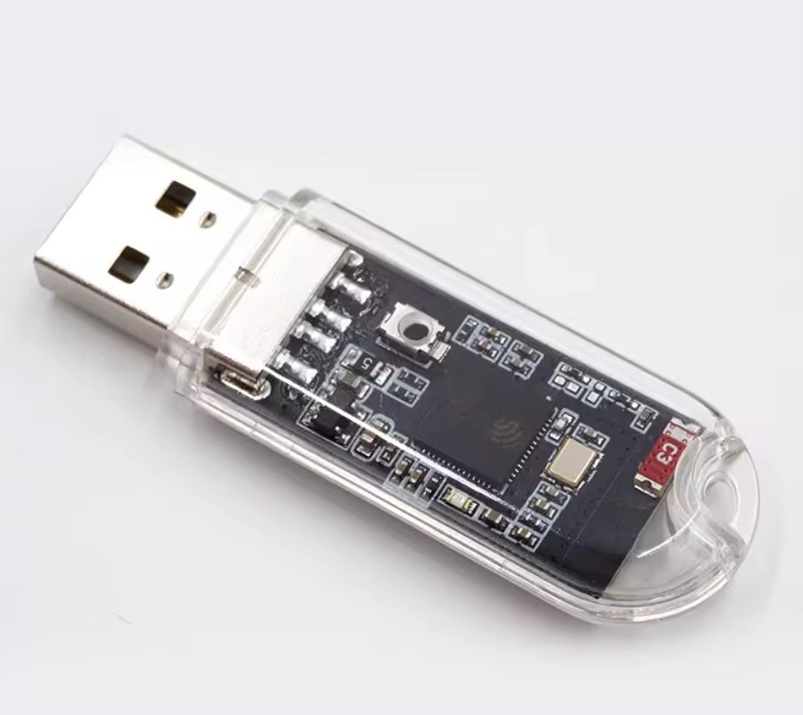

# ESP-BadUSB-S3-Key

BadUSB firmware for the **ESP32-S3-Dongle / ESP32-S3-Key** — a USB-A stick board
(schematic marking `ESP32-S3-Dongle v1.0g`) with one blue LED, one button, and
a microSD slot.



## Board

| Function | GPIO | Notes |
|---|---|---|
| Onboard LED | GPIO1 | Single blue LED, active-HIGH via `GPIO1 → 1 kΩ → LED → GND`, driven with PWM. |
| Button | GPIO0 | `S1` to GND, active-LOW. Short press stops a running script; 10-second hold factory-resets. |
| microSD | CS 34, MOSI 35, MISO 37, SCK 36 | Wired for SDMMC (`SD_D3/SD_CMD/SD_D0/SD_CLK`), used here in 1-bit SPI mode. |
| USB | native | ESP32-S3 USB-OTG (TinyUSB HID + MSC composite). Default VID `0x303A`, PID `0x0002`. |

Requires a FAT32 microSD. The firmware auto-creates `/languages`, `/scripts`,
`/logs`, `/uploads`, `/extensions/{hak5,custom}` on first boot.

Default AP: **ESP32-BadUSB** / `badusb123` → http://192.168.4.1

## Differences from the DevKitC variant

`GpioLed.h` is a drop-in shim over the `Adafruit_NeoPixel` subset the project
uses (`begin`, `setBrightness`, `Color`, `setPixelColor`, `show`) that drives a
single GPIO LED instead. Any non-black colour maps to a PWM duty on the blue
channel; every LED status mode (solid, blink, warning, completion) works, just
in blue. `Config.h` pins the LED to GPIO1 and the SD to 34/35/37/36. No
`Adafruit_NeoPixel` dependency.

Everything else — web UI, DuckyScript interpreter, WiFi AP, BLE, SD scripts,
logging, MSC — is shared with the base project.

## DuckyScript 3.0 / Hak5 extensions

The interpreter implements the full Hak5 DuckyScript 3.0 corpus used by the
official [`usbrubberducky-payloads`](https://github.com/hak5/usbrubberducky-payloads)
extensions: `EXTENSION`/`END_EXTENSION` framing, `IMPORT`, `RUN_EXTENSION`,
`FUNCTION`, `DEFINE`/`IF_DEFINED_TRUE`, `REM_BLOCK`, `STRING_BASH`/`STRING_POWERSHELL`,
`BUTTON_DEF`, `WAIT_FOR_*`, `HIDE_PAYLOAD`/`RESTORE_PAYLOAD`/`STOP_PAYLOAD`,
`SAVE_HOST_KEYBOARD_LOCK_STATE`, `INJECT_MOD`, `$_OS`/`$_CAPSLOCK_ON`/other
`$_`-prefixed built-ins, and the rest.

Two extension folders on the SD:

- `/extensions/hak5/` — Hak5-strict semantics inside `EXTENSION` blocks
  (`ATTACKMODE STORAGE` drops HID, matching Hak5's spec).
- `/extensions/custom/` — our UX-friendly semantics (`STORAGE` keeps HID so
  a typo doesn't lock you out of typing recovery scripts).

An empty-body `EXTENSION os_detect / END_EXTENSION` (or the collapsed
`EXTENSION os_detect ˅` marker) triggers Pass 0 to load the body from the SD
inline, so subsequent `DETECT_OS` calls resolve. Case-insensitive on the
filename. See `ESP-BadUSB-S3-Key/DuckyInterpreter.cpp` for the preprocessor.

## ATTACKMODE (Hak5-compatible)

```
REM Keyboard only
ATTACKMODE HID VID_046D PID_C31C

REM Keyboard + storage — STORAGE keeps HID by default (no lockout on typo)
ATTACKMODE HID STORAGE VID_046D PID_C31C
ATTACKMODE STORAGE

REM Storage only, explicit — no keyboard
ATTACKMODE STORAGE_ONLY

REM Storage off, keep HID
ATTACKMODE OFF
```

Composition changes (HID↔STORAGE) and identity changes (VID/PID) both save the
current script to `/temp_resume.txt` and reboot the ESP; setup() picks the
resume file up and re-runs after the new descriptor is live.

**Hak5 divergence:** classic Hak5 `ATTACKMODE STORAGE` = storage-only, no
keyboard. Here `STORAGE` alone keeps HID because a typo silently locking you
out of the recovery path is worse than the divergence. Use `STORAGE_ONLY` /
`NO_HID` for the classic behaviour.

## SIZE

Report a stick capacity to the host:

```
SIZE_22_GB
ATTACKMODE HID STORAGE          REM standalone form
ATTACKMODE HID STORAGE SIZE_5000_KB
```

Requests larger than the physical SD are clamped and the request surfaces on
the dashboard as `lastError`.

## HID stealth

`HID_ATTACH` / `HID_DETACH` present or hide the keyboard mid-script. Settings →
Silent Startup makes the device present no HID at boot (no Windows connect
chime); the keyboard attaches only while a script runs or Live typing is active
and detaches again after.

How it works (three layers, no eFuse, no hardware mod):

1. C++ constructor at `.init_array` priority 101 (in `USBManager.cpp`) runs
   during the C runtime static-init pass, before `main()` / `setup()`. It sets
   `USB_SERIAL_JTAG.conf0.pad_pull_override = 1` with all D+/D- pull-up bits
   at 0 — the electrical signal that tells any USB host "there is no device
   here." Earliest hook Arduino/ESP-IDF exposes.
2. Setup Step 0 reads the persisted `silent_boot` NVS pref and re-asserts the
   same override — belt and suspenders in case something between the
   constructor and setup wobbled it.
3. `silentRestorePadsForUsb()` clears the override on non-silent boots, or
   when `ensureHidReady()` is asked to bring HID online. The USB PHY pads
   themselves are never disabled (that broke `tud_hid_ready` after
   enumeration); only the pull-up-override bit toggles.

The ESP32-S3 ROM asserts D+ pull-up ~1 ms after power. No user code can run
before that, but the constructor kills the pull-up fast enough that Windows
never completes enumeration — nothing lands in Device Manager and the aborted
attach doesn't play the connect chime. If a future OS chimes on that
nanosecond D+ pulse, only `DIS_USB_JTAG` eFuse burn or an external USB switch
(the O.MG-cable approach) can silence it.

## Live typing

Type in the browser and every keystroke is forwarded to the host over HID in
real time — Enter/Backspace/Tab/Esc, arrows, and Ctrl/Alt/Gui combos included.
Endpoint: `POST /api/live-type`.

## `.espkg` update packages

A `.espkg` bundles the SD website files and, optionally, a firmware image. Web
UI → Settings → *Firmware Update* → pick the file → *Upload & Apply*. The
device writes the SD files first, then flashes the firmware over-the-air and
reboots. Do not unplug during apply.

Build one with the helper:

```
python tools/build_espkg.py --web "Website [ESP SD]" \
  --firmware build/ESP-BadUSB-S3-Key.ino.bin \
  --version 4.35 -o dist/full.espkg
```

Or compile + package + flash in one shot:

```
python tools/build_espkg.py --force-compile --flash-after-done \
  --port COM6 -o dist/full.espkg
```

Container: `ESPKG\x01` magic (6 bytes) · `uint32` manifest length · manifest
JSON (`{version, sd:[{path,size,crc32}], fw:{size,crc32}}`) · payloads
concatenated, SD files first, firmware last. SD-first because flashing the
firmware reboots the chip.

## Build / flash

Arduino ESP32 core 3.x. Board **ESP32S3 Dev Module** with:

```
USB Mode:          USB-OTG (TinyUSB)
USB CDC On Boot:   Disabled
Flash Size:        8MB
Partition Scheme:  8M with spiffs (3MB APP / 1.5MB SPIFFS)
PSRAM:             Disabled
```

FQBN:

```
esp32:esp32:esp32s3:USBMode=default,FlashSize=8M,CDCOnBoot=default,UploadMode=default,PartitionScheme=default_8MB,PSRAM=disabled
```

## Releases

Every tagged release attaches the corresponding `dist/badusb-full-<ver>.espkg`
so you can drop it straight into the web UI updater. Source tarballs come with
each release automatically. See [releases](https://github.com/QWavey/ESP-S3-Key-BadUSB/releases).
